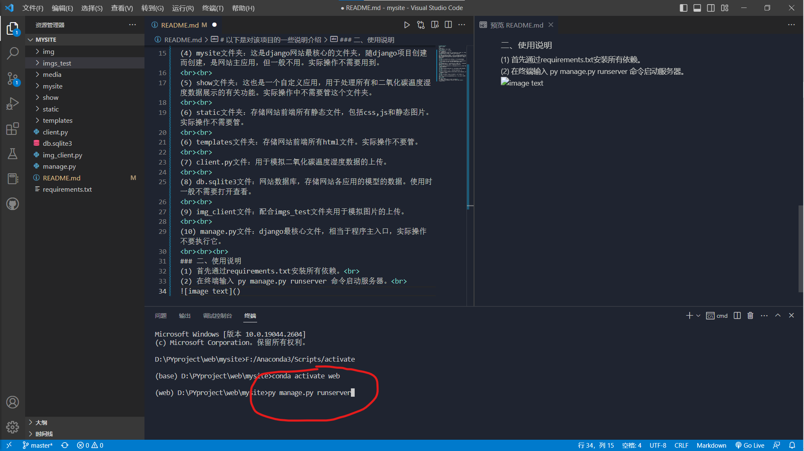
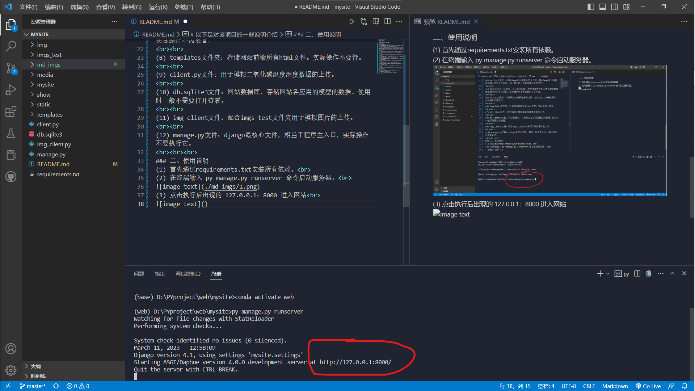
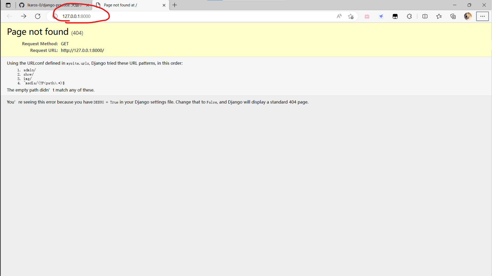
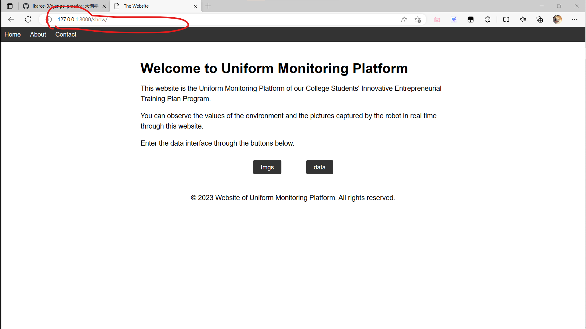
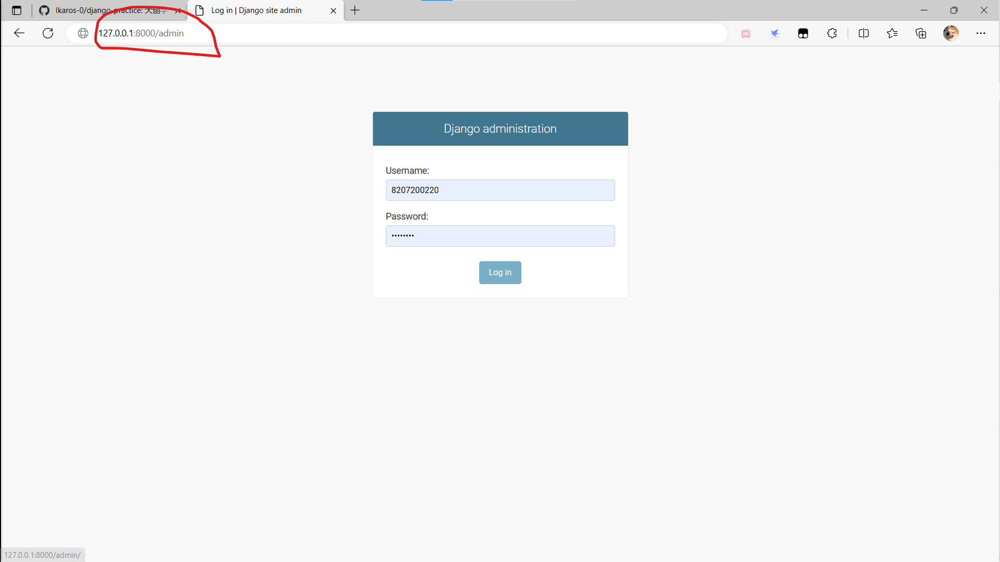
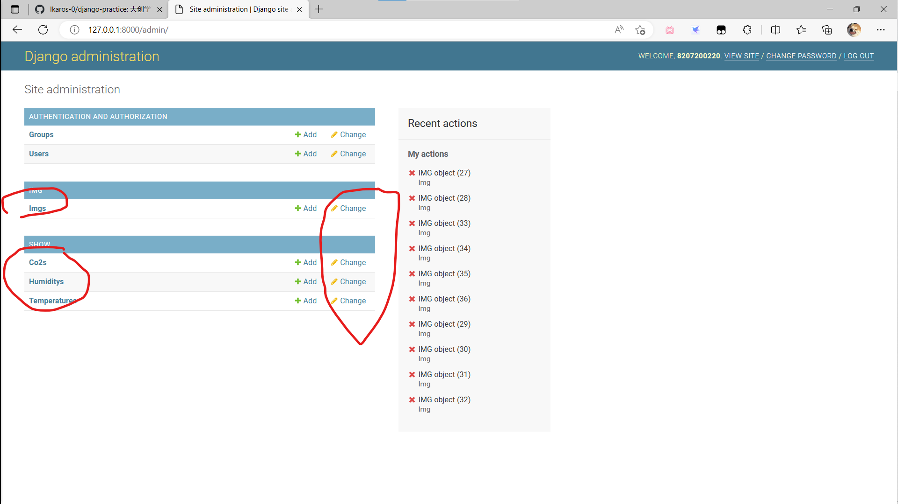

# django-practice
大创学习做网站
 
# 2023/3/11
完成基本demo版，实现基本功能
   
# 以下是对该项目的一些说明介绍
### 一、文件说明
(1) img文件夹：这是django中的一个自定义应用，用于处理所有和图片展示有关的各项功能。实际操作中不需要用到这个文件夹。
  
(2) imgs_test文件夹：里面存储着开发者用于测试img应用（网站图片展示功能）的16张图片，可以配合img_client.py文件实现对网站的图片上传。可以在测试的时候用这里面的图片，也可以自带图片。暂时实测图片大小为300kb以下。
  
(3) md_imgs文件夹：用于存储README.MD文件中使用到的图片。请忽略。
  
(4) media/upload文件夹：这是网站收到上传的图片后的存储地址。
  
(5) mysite文件夹：这是django网站最核心的文件夹，随django项目创建而创建，是网站主应用，但一般不用。实际操作不需要用到。
  
(6) show文件夹：这也是一个自定义应用，用于处理所有和二氧化碳温度湿度数据展示的有关功能。实际操作中不需要管这个文件夹。
  
(7) static文件夹：存储网站前端所有静态文件，包括css,js和静态图片。实际操作不需要管。
  
(8) templates文件夹：存储网站前端所有html文件。实际操作不要管。
  
(9) client.py文件：用于模拟二氧化碳温度湿度数据的上传。
  
(10) db.sqlite3文件：网站数据库，存储网站各应用的模型的数据。使用时一般不需要打开查看。
  
(11) img_client文件：配合imgs_test文件夹用于模拟图片的上传。
  
(12) manage.py文件：django最核心文件，相当于程序主入口，实际操作不要执行它。
   
### 二、使用说明
(1) 首先通过requirements.txt安装所有依赖。 
(2) 在终端输入 py manage.py runserver 命令启动服务器。 

(3) 点击执行后出现的 127.0.0.1：8000 进入网站 

(4) 进入网站后在导航栏 127.0.0.1:8000 后面加 /show 进入主界面 

(5) 现在即可使用网站。点击导航栏 home 回到主页；点击 imgs 进入图片展示；点击 data 进入数据展示。 
需要模拟数据或图片上传请在先启动网站的前提下运行client.py或img_client.py。在点击 data 进入数据展示页面前，最好先运行client.py模型数据上传，因为该页面一直在获取数据库最新数据，不更新数据会导致表格不美观等bug。 
<!-- 
(6)重点：
 -->
$\color{red}{(6)重点：}$ 
如果需要后台管理网站已存储的数据（如二氧化碳数据或者图片），对其进行删除操作的话。请在导航栏 127.0.0.1：8000/admin 网站后台管理员面。

 
此处可以直接删除二氧化碳温度湿度数据，删除图片需现在此处删除图片数据，然后再回到项目根目录 media/upload 文件夹删除相应图片，否则会出现错误。
  
管理员账密请联系开发者。 
PS：可通过后台管理界面删除数据，但最好不要通过该界面上传数据。上传数据请规范按照两个client文件上传！！！
   

### 存在其他问题请联系开发者
### 网站还需改进......
### 请不要在 master 该分支进行推送更改！！！
